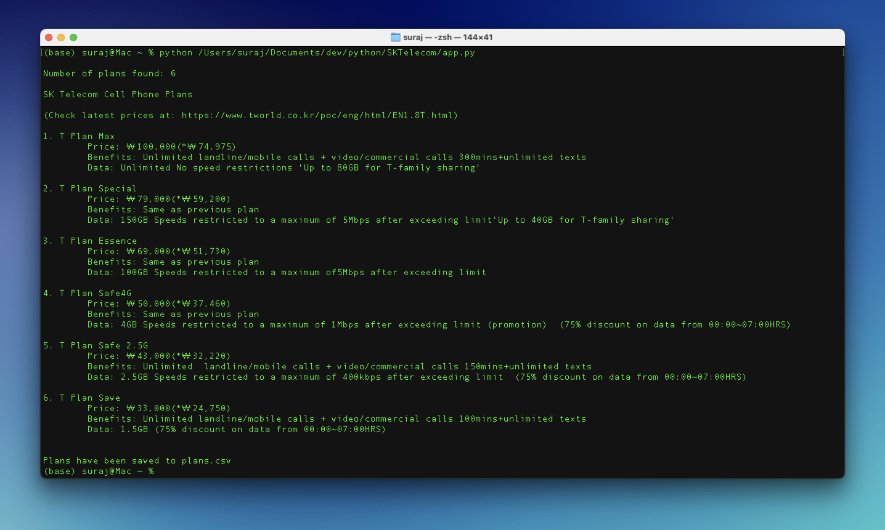
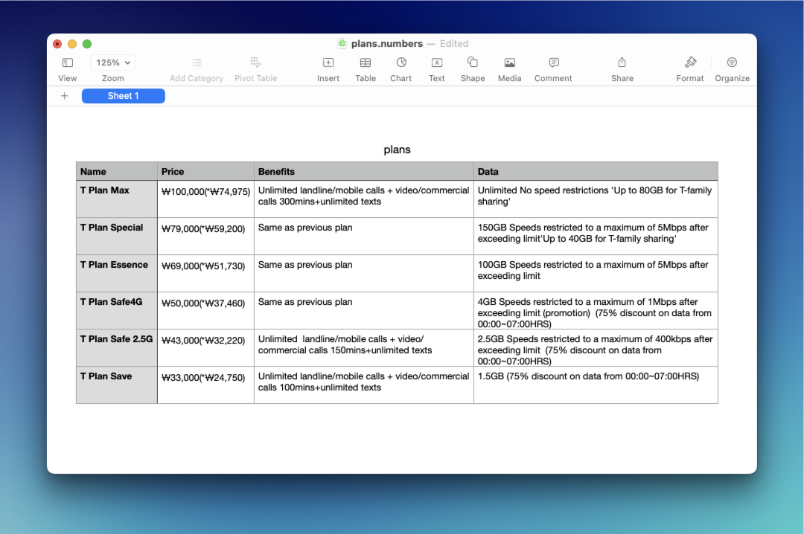

# SKTelecom
 The plan details of the largest phone carrier of South Korea.

The program fetches the plan details (name, pricing, benefits, data) of each of the offered plans. Then, it displays the data in terminal, and also creates a csv file with all the data organized.

